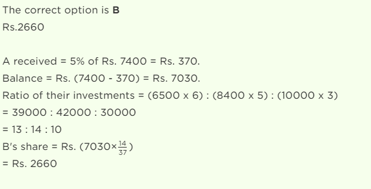
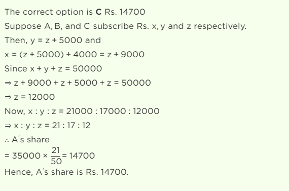
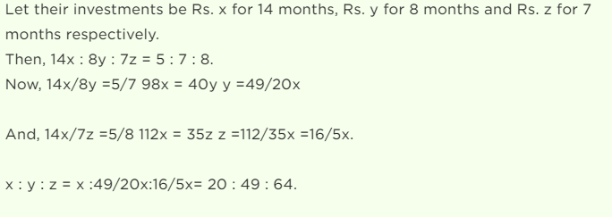

#1

A, B and C jointly thought of engaging themselves in a business venture. It was agreed that A would invest Rs. 6500 for 6 months, B, Rs. 8400 for 5 months and C, Rs. 10,000 for 3 months. A wants to be the working member for which he was to receive 5% of the profits. The profit earned was Rs. 7400. Calculate the share of B in the profit.

#2

A, B and C enter into a partnership in the ratio (7/2) : (4/3) : (6/5). After 4 months, A increases his share 50%. If the total profit at the end of one year be Rs. 21,600, then B's share in the profit is:

#3

A, B, C subscribe Rs. 50,000 for a business. A subscribes Rs. 4000 more than B and B Rs. 5000 more than C. Out of a total profit of Rs. 35,000, A receives:

#4

Three partners shared the profit in a business in the ratio 5 : 7 : 8. They had partnered for 14 months, 8 months and 7 months respectively. What was the ratio of their investments?

