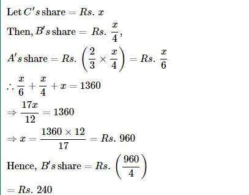

#1

## A man has Rs.480 in the denominations of one-rupee notes, five-rupee notes and ten-rupee notes. The number of notes of each denomination is equal. What is the total number of notes that he has ?


#2

## 


#3

## The price of 2 sarees and 4 shirts is Rs. 1600. With the same money one can buy 1 saree and 6 shirts. If one wants to buy 12 shirts, how much shall he have to pay ?


#4

## A sum of Rs. 1360 has been divided among A, B and C such that A gets ⅔ of what B gets and B gets ¼ of what C gets. B's share is:




#5

## One-third of Rahul's savings in the National Savings Certificate is equal to one-half of his savings in the Public Provident Fund. If he has Rs. 1,50,000 as total savings, how much has he saved in the Public Provident Fund ?


#6

## In a regular week, there are 5 working days and for each day, the working hours are 8. A man gets Rs. 2.40 per hour for regular work and Rs. 3.20 per hours for overtime. If he earns Rs. 432 in 4 weeks, then how many hours does he work for ?


#7

## Solve: 2(x – 3) – (5 – 3x) = 3 (x + 1) – 4(2 + x)


#8

## The length of a rectangle is 8cm more than its breadth. If the perimeter of the rectangle is 68 cm, find its length and breadth.


#9

## A man when asked how many hens and buffaloes he has told that his animals have 120 eyes and 180 legs. How many hens have he?


#10

## If 5 added to twice of a number it becomes 6, then the number is


#11

## The sum of the two numbers is 11 and their product is 30, then the numbers are

```
Assume the two numbers be p and n
Then,
p + n = 11 ...... (1)

p × n = 30 ...... (2)

★Here we have to solve equation (2)

★Putting the value of n in equation (1)
p² - 11p + 30 = 0
p² - 6p - 5p + 30 = 0
p(p - 6) + 5(p - 6) = 0
(p - 6) = 0
p = 6
(p - 5) = 0
p = 5

★Here we get the numbers :-

```

#12

## If one number is thrice the other and their sum is 20, then the numbers are

```
Let one number be x
Then the number be 3x
Sum of the numbers = 20
According to the problem,
x + 3x = 20
4x = 20
x = 20/4
x = 5
One number = x = 5
Then the other number = 3x = 3(5) = 15
Therefore, the numbers are 5 and 15.
```
#13

## The distance between two stations is 340 km. two trains start simultaneously from these stations on parallel tracks to cross each other. The speed of one of them is greater than that of the other by 5 km/h. If the distance between the two trains after 2 hours of their start is 30 km, then the speed of each train are

```
let the speed of one train is x km/h
then the speed of another train is (x+5)km/h
distance travelled by first train in two hour is x×2=2x
distance travelled by another train is(2(x+5)=2x+10
the total distance travelled by two trains are 2x+2x+10=4x+10
According to question
4x+10=310
4x=310 - 10 =300
x=300/4=75km/h
speed of another train=75+5=80km/h
```
#14

## Three prizes are to be distributed in a quiz contest. The value of the second prize is five-sixth of the value of the first price and the value of the third prize is four-fifth of that of the second prize. If the total value of the three prizes is Rs.150, then the value of each price is respectively

```
Let the value of first prize = x
Value of second prize = 5/6(value of the first prize)= 5x/6
Value  of third prize = 4/5(Value  of the second prize)
= 4/5 (5x/6) = 2x/3
Total value of three prizes = Rs 150
-> x + 5x/6 + 2x/3 = 150
-> (6x + 5x + 4x )/6 = 150
-> 15x/6 = 150
-> x = 60
Hence , value of first prize = Rs 60
Value of second prize = 5/6 x Rs 60 = Rs 50
Value of third prize = 2/3 x  Rs 60 = Rs 40
```

#15

## One of the angles of a triangle is equal to the sum of the other two angles. If the ratio of the other two angles is 4:5, then the angles of triangle are

