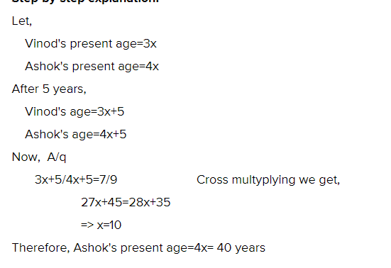
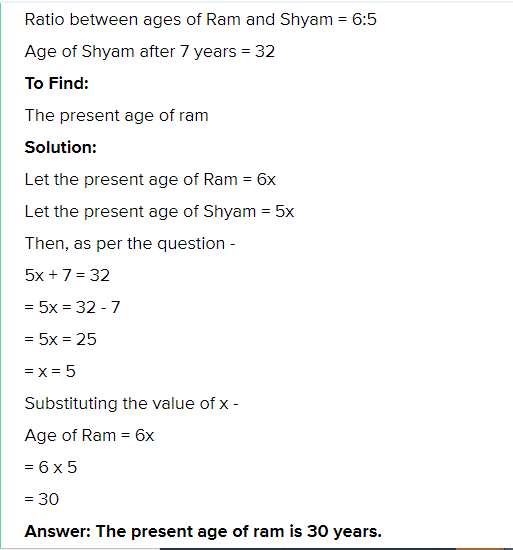
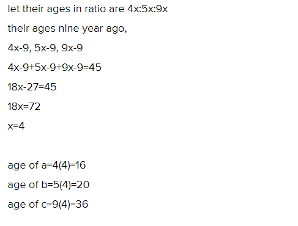

#1

Present age of Vinod and Ashok are in ratio of 3:4 respectively. After 5 years, the ratio of their ages becomes 7:9 respectively. What is Ashok’s present age is ?

#2

At present, the ratio between the ages of Ram and Shyam is 6:5 respectively. After 7 years, Shyam’s age will be 32 years. What is the present age of Ram?

#3

The present ages of A, B and C are in proportions 4:5:9. Nine years ago, sum of their ages was 45 years. Find their present ages in years

